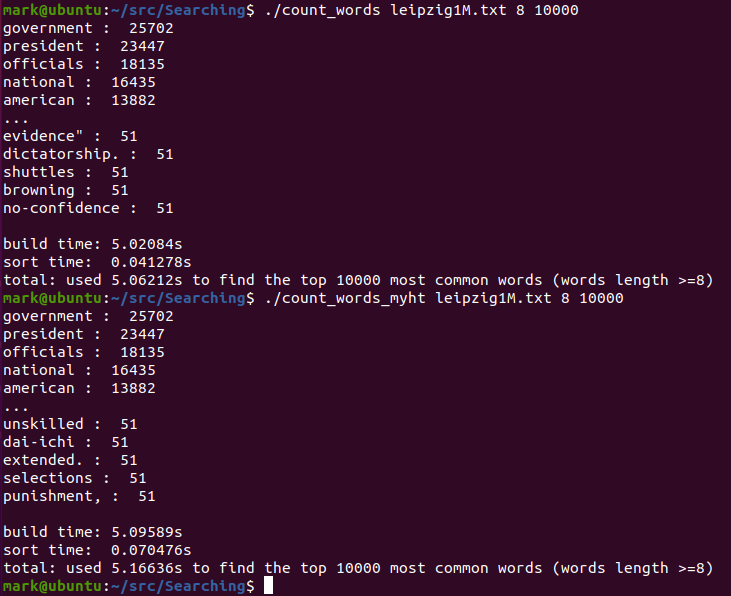
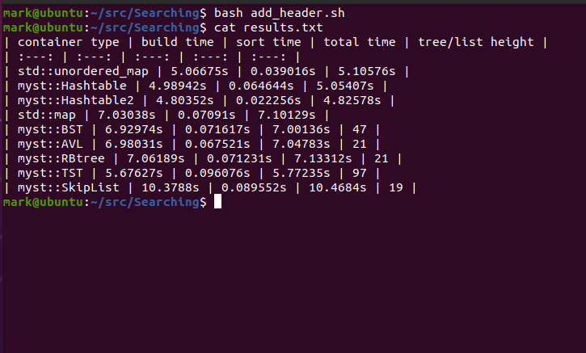

# Count Words
| container type | build time | sort time | total time | tree/list height |
| :---: | :---: | :---: | :---: | :---: |
| std::unordered_map | 5.06675s | 0.039016s | 5.10576s |
| myst::[Hashtable](https://github.com/How-u-doing/DataStructures/blob/master/Searching/HashMap/Hashtable_impl.h) | 4.98942s | 0.064644s | 5.05407s |
| myst::[Hashtable2](https://github.com/How-u-doing/DataStructures/blob/master/Searching/HashMap/alternative/Hashtable2_impl.h) | 4.80352s | 0.022256s | 4.82578s |
| std::map | 7.03038s | 0.07091s | 7.10129s |
| myst::[BST](https://github.com/How-u-doing/DataStructures/blob/master/Searching/TreeMap/BST_impl.h) | 6.92974s | 0.071617s | 7.00136s | 47 |
| myst::[AVL](https://github.com/How-u-doing/DataStructures/tree/master/Searching/TreeMap/AVLtree_impl.h) | 6.98031s | 0.067521s | 7.04783s | 21 |
| myst::[RBtree](https://github.com/How-u-doing/DataStructures/blob/master/Searching/TreeMap/RBtree_impl.h) | 7.06189s | 0.071231s | 7.13312s | 21 |
| myst::[TST](https://github.com/How-u-doing/DataStructures/blob/master/Searching/TreeMap/TST.h) | 5.67627s | 0.096076s | 5.77235s | 97 |
| myst::[SkipList](https://github.com/How-u-doing/DataStructures/blob/master/Searching/Randomized/SkipList_impl.h) | 10.3788s | 0.089552s | 10.4684s | 19 |

and the size of the lookup table (word length >= 8) is `278063`.

Note that `height(TST) >=  max_word_length`, which is `80` in this case.
We can reduce a TST's height by hybriding TST with R^2-way branching at the root. 

# Unordered

# Ordered

# Summary

