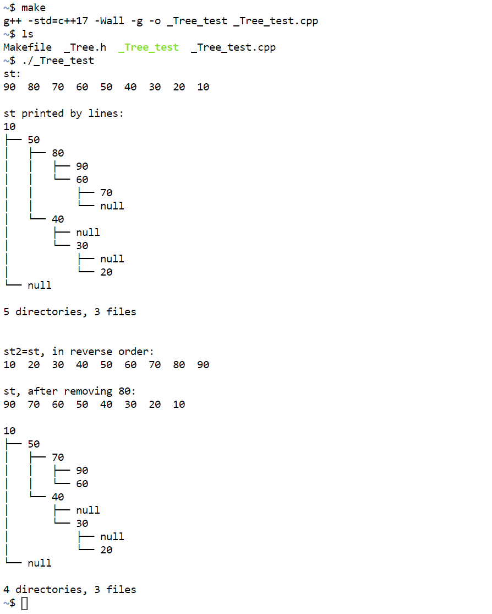
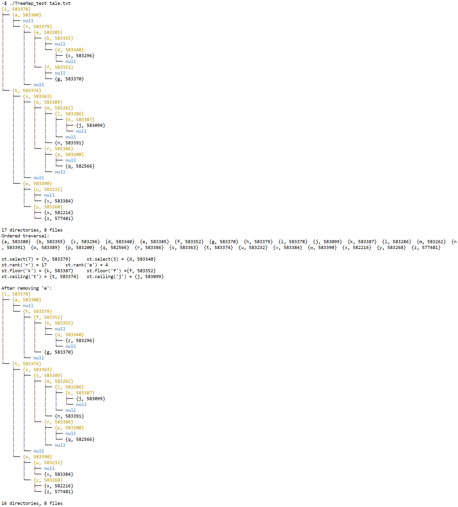
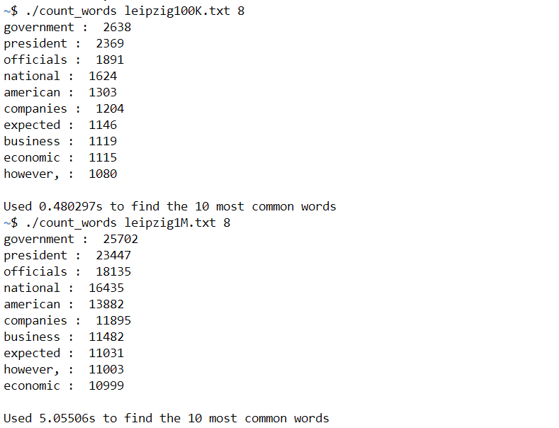
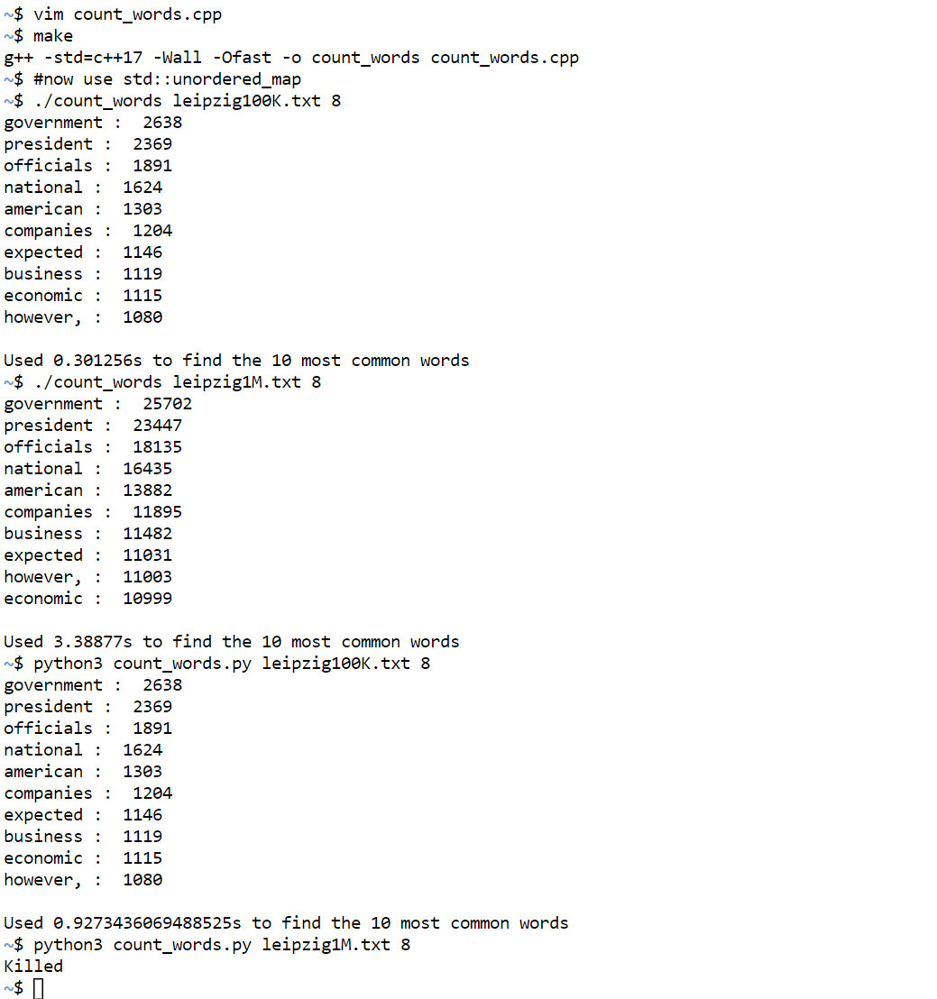

## \_Tree.h (also set) test

## TreeMap.h test

## Count words using my symbol table

## Python routine and C++ std::unordered\_map version for counting words

Additionally, here is some tests under my *Kali* Linux virtual machine,
see `virtual_machine_tests.png`.
