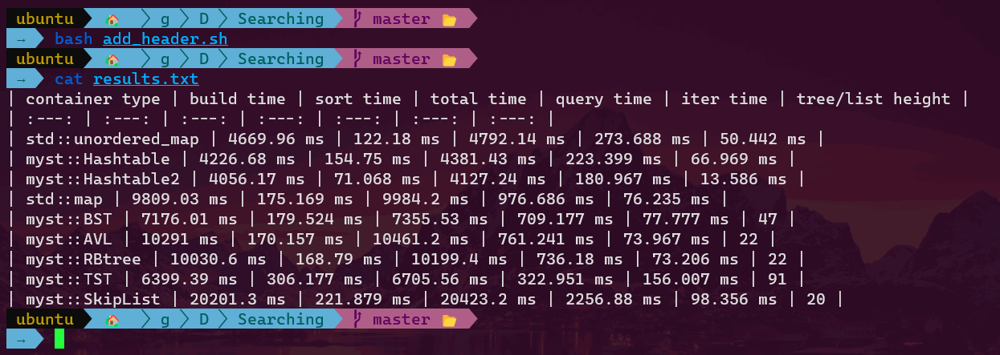

# Count Words
| container type | build time | sort time | total time | query time | iter time | tree/list height |
| :---: | :---: | :---: | :---: | :---: | :---: | :---: |
| std::unordered\_map | 4669.96 ms | 122.18 ms | 4792.14 ms | 273.688 ms | 50.442 ms |
| [myst::Hashtable](https://github.com/How-u-doing/DataStructures/blob/master/Searching/HashMap/Hashtable_impl.h) | 4226.68 ms | 154.75 ms | 4381.43 ms | 223.399 ms | 66.969 ms |
| [myst::Hashtable2](https://github.com/How-u-doing/DataStructures/blob/master/Searching/HashMap/alternative/Hashtable2_impl.h) | 4056.17 ms | 71.068 ms | 4127.24 ms | 180.967 ms | 13.586 ms |
| [absl::flat\_hash\_map](https://github.com/abseil/abseil-cpp/blob/master/absl/container/flat_hash_map.h) | 3255.41 ms | 25.121 ms | 3280.53 ms | 89.852 ms | 4.557 ms |
| std::map | 9809.03 ms | 175.169 ms | 9984.2 ms | 976.686 ms | 76.235 ms |
| [myst::BST](https://github.com/How-u-doing/DataStructures/blob/master/Searching/TreeMap/BST_impl.h) | 7176.01 ms | 179.524 ms | 7355.53 ms | 709.177 ms | 77.777 ms | 47 |
| [myst::AVL](https://github.com/How-u-doing/DataStructures/tree/master/Searching/TreeMap/AVLtree_impl.h) | 10291 ms | 170.157 ms | 10461.2 ms | 761.241 ms | 73.967 ms | 22 |
| [myst::RBT](https://github.com/How-u-doing/DataStructures/blob/master/Searching/TreeMap/RBtree_impl.h) | 10030.6 ms | 168.79 ms | 10199.4 ms | 736.18 ms | 73.206 ms | 22 |
| [myst::TST](https://github.com/How-u-doing/DataStructures/blob/master/Searching/TreeMap/TST.h) | 6399.39 ms | 306.177 ms | 6705.56 ms | 322.951 ms | 156.007 ms | 91 |
| [myst::SkipList](https://github.com/How-u-doing/DataStructures/blob/master/Searching/Randomized/SkipList_impl.h) | 20201.3 ms | 221.879 ms | 20423.2 ms | 2256.88 ms | 98.356 ms | 20 |

and the size of the lookup table (word length >= 4) is `479,880`.

Note that `height(TST) >= max_word_length`, which is `80` in this case.
We can reduce a TST's height by hybridizing it with R²-way branching at root.

# Unordered

# Ordered

# Summary

