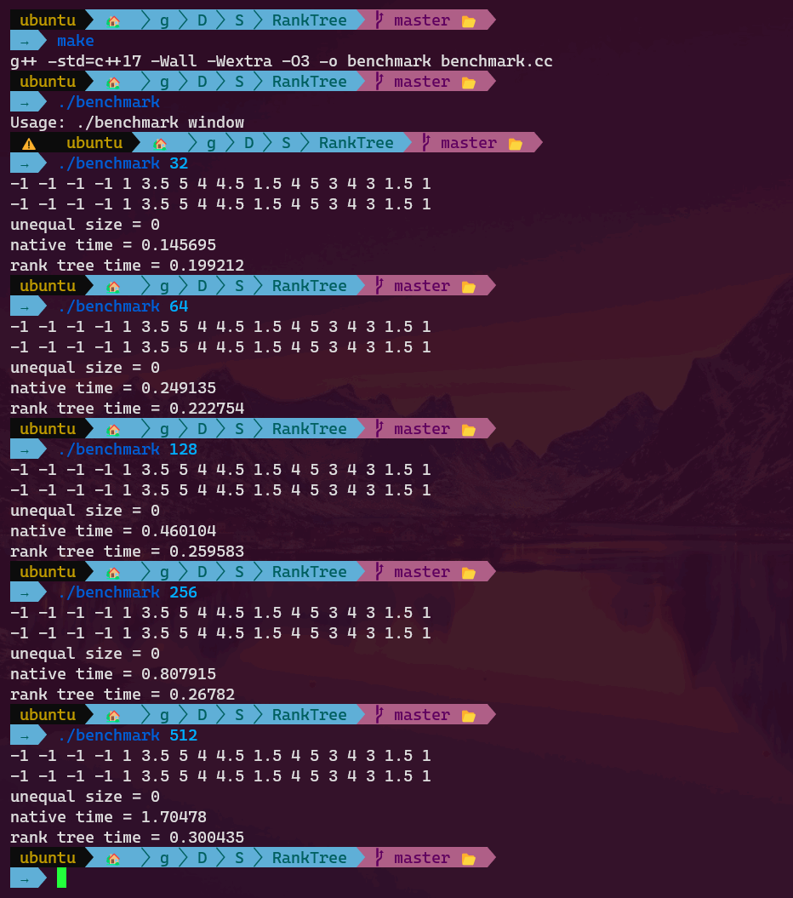

# O(n\*log(window)) Complexity Rolling Rank
We implemented [pandas rolling rank](https://pandas.pydata.org/docs/dev/reference/api/pandas.core.window.rolling.Rolling.rank.html) in O(n\*log(window)) using [rank trees](https://algs4.cs.princeton.edu/32bst/) (pandas uses a [skip list](https://github.com/pandas-dev/pandas/blob/main/pandas/_libs/src/skiplist.h)).

