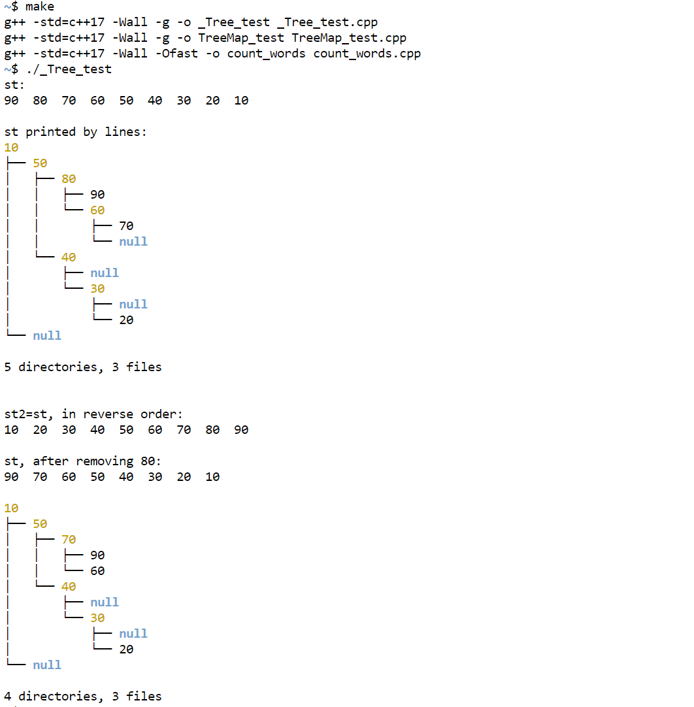
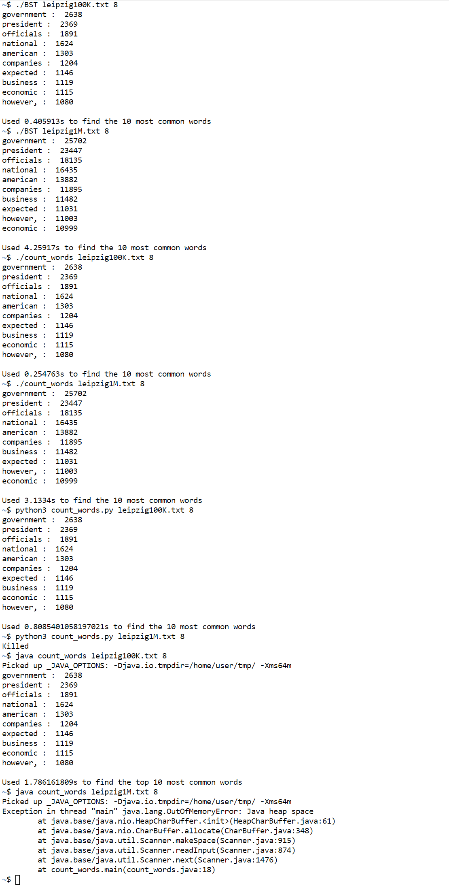
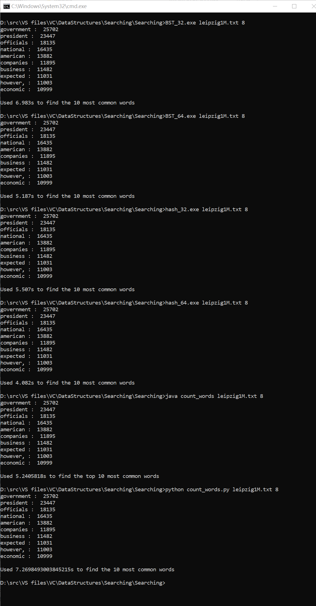

## \_Tree.h (also set) test

## TreeMap.h test

## Count words on CoCalc

## Count words on my local machine

Additionally, here are some tests under my *Kali* Linux virtual machine,
see [virtual_machine_tests.png](img/virtual_machine_tests.png).
