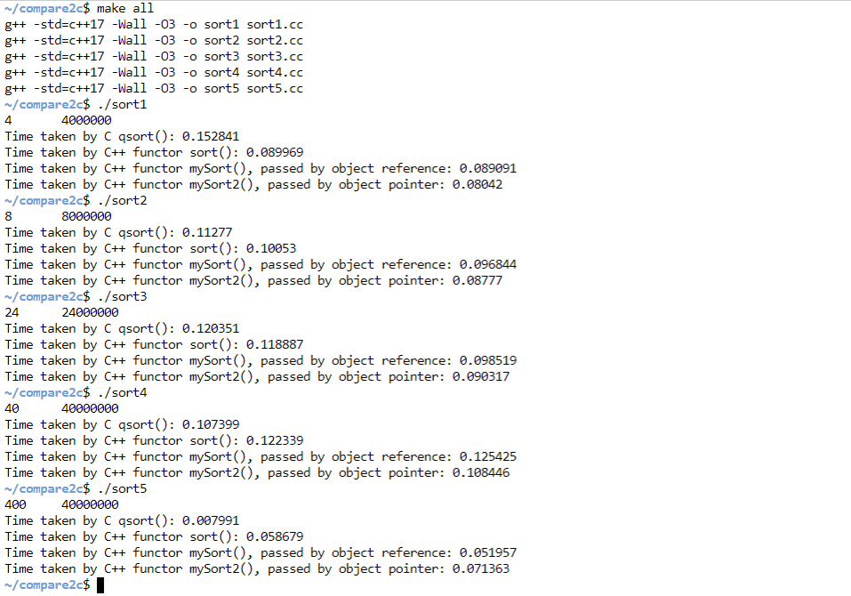

# C qsort() vs C++ sort() on large objects

---

Updated on Nov 21, 2020
These tests are inaccurate and buggy, see [here](https://github.com/How-u-doing/DataStructures/tree/master/Sorting/test) instead.

There is an awful bug (typo) on qsort, that is `qsort(arr1, N, sizeof(int), compare)`.
I mistakenly wrote `sizeof(int)` applying on `qsort` for sorting an array of objects
 which in this case are of `Employee` type. They're NOT of size `int` type!! What a 
horrible typo! And the compilers all remained silient on this!! We were [q]sorting an
array starting at address `arr1`, which is of address type `Employee*` and will be
casted to `void*` for generic sorting using the comparator which uses `void*` as its
two parameters' type. Think about this! Sorting the array every 4 bytes (`sizeof(int)`)
by using the comparator to dereference and access the structure's data member
 (filed `id`). For most of times, it's not accessing them from the begining of those
objects, but rather in some inner parts of them. Awfull!! No warnning, no error messages
at all!!! So we would have results like this (astouding):
_always.png)

---

Say let's try to sort 10M objects:
```c++
enum Gender : char  {M, W};

struct Employee {
	int id;
	Gender gender;
	char addr[10];
	double salary;
	double s;
	int t;	
};
	
const int N = (int) 1e7;
```
In `sort.cc`, the size of a single object is 40 bytes, so each array will require about 400 MiB of memory. In `sort+.cc`, we increase the `addr` size to 370, in turn, the size of each object will be 9 times larger (i.e. 400 bytes). Meanwhile we decrease the number of objects to 1M, otherwise it would be about 4GiB:scream:. `sort0.cc` and `sort0+.cc` ditto. 

Here are some results I've tested on my CentOS server and Kali virtual machine:




See also some tests on *coliru* online compiler: [sort0](https://coliru.stacked-crooked.com/a/af0ba8941deb64f4),
 [sort0+](https://coliru.stacked-crooked.com/a/62800e4bbcbbbe8d). You can change the size of `addr` and `N` to see
how result varies. 

## Discussion
From above results, we can see that as the struct size increses, the performance of sort() routine seems
to decline, whereas the qsort() seems to remain unchanged (by comparison of first two items of `./sort0` and
`./sort0+`, `N` changes to its `1/10`, qsort() time cost also changes to about its `1/10`, though with struct
 size getting 10 times as large (and different data); sort(), however, doesn't scale in this way.)

Then, what possibly caused it? Well, first I thought it was the compare parameter type: qsort() takes `const void*`,
 whereas sort() takes `const T&`. The pointer type surely has less overhead when arguments passed. In this way,
each time a compare function is called, sort() has to ~~construct~~ 2 objects whereas 0 from qsort(). (I made a 
mistake:sweat\_smile:, that the two arguments should be elements that are parts of the array. So don't need to *construct*)
 That sounds reasonable, but qsort() also need to `swap` objects if need to, which usually just does *3 times copy*. While C++
introduced `std::move` (since c++11) to elude copy. It might have some overhead, but should be trivial. Additionally, I made
a pair of contrast between pass by `pointer` and by `reference` using quicksort algorithm (see `../mySort.h` and `mySort2.h`).
It turned out that the deference is insignificant (see last two items of `./sort[+]` from above screenshots).

So, if no constructing objects in sort() plus qsort() uses *3 times copy* when swapping, then what makes qsort() faster than 
sort() when sorting large objects?

---

## Preliminary Conjecture
Using `gdb` for debugging I found qsort() enters a file called `msort.c`, whose source code can be found 
[here](https://github.com/lattera/glibc/blob/master/stdlib/msort.c). It seems qsort() can utilize 
memory paging for optimization on large objects, and qsort() is smart enough to choose proper methods
depending on the object size, array size, pagesize.  

Code snippet from `msort.c`:
```c
void
__qsort_r (void *b, size_t n, size_t s, __compar_d_fn_t cmp, void *arg)
{
  size_t size = n * s;
  char *tmp = NULL;
  struct msort_param p;

  /* For large object sizes use indirect sorting.  */
  if (s > 32)
    size = 2 * n * sizeof (void *) + s;

  if (size < 1024)
    /* The temporary array is small, so put it on the stack.  */
    p.t = __alloca (size);
  else
    {
      /* We should avoid allocating too much memory since this might
	 have to be backed up by swap space.  */
      static long int phys_pages;
      static int pagesize;

      if (pagesize == 0)
	{
	  phys_pages = __sysconf (_SC_PHYS_PAGES);

	  if (phys_pages == -1)
	    /* Error while determining the memory size.  So let's
	       assume there is enough memory.  Otherwise the
	       implementer should provide a complete implementation of
	       the `sysconf' function.  */
	    phys_pages = (long int) (~0ul >> 1);

	  /* The following determines that we will never use more than
	     a quarter of the physical memory.  */
	  phys_pages /= 4;

	  /* Make sure phys_pages is written to memory.  */
	  atomic_write_barrier ();

	  pagesize = __sysconf (_SC_PAGESIZE);
	}

      /* Just a comment here.  We cannot compute
	   phys_pages * pagesize
	   and compare the needed amount of memory against this value.
	   The problem is that some systems might have more physical
	   memory then can be represented with a `size_t' value (when
	   measured in bytes.  */

      /* If the memory requirements are too high don't allocate memory.  */
      if (size / pagesize > (size_t) phys_pages)
	{
	  _quicksort (b, n, s, cmp, arg);
	  return;
	}

      /* It's somewhat large, so malloc it.  */
      int save = errno;
      tmp = malloc (size);
      __set_errno (save);
      if (tmp == NULL)
	{
	  /* Couldn't get space, so use the slower algorithm
	     that doesn't need a temporary array.  */
	  _quicksort (b, n, s, cmp, arg);
	  return;
	}
      p.t = tmp;
    }

  p.s = s;
  p.var = 4;
  p.cmp = cmp;
  p.arg = arg;

  if (s > 32)
    {
      /* Indirect sorting.  */
      char *ip = (char *) b;
      void **tp = (void **) (p.t + n * sizeof (void *));
      void **t = tp;
      void *tmp_storage = (void *) (tp + n);

      while ((void *) t < tmp_storage)
	{
	  *t++ = ip;
	  ip += s;
	}
      p.s = sizeof (void *);
      p.var = 3;
      msort_with_tmp (&p, p.t + n * sizeof (void *), n);

      /* tp[0] .. tp[n - 1] is now sorted, copy around entries of
	 the original array.  Knuth vol. 3 (2nd ed.) exercise 5.2-10.  */
      char *kp;
      size_t i;
      for (i = 0, ip = (char *) b; i < n; i++, ip += s)
	if ((kp = tp[i]) != ip)
	  {
	    size_t j = i;
	    char *jp = ip;
	    memcpy (tmp_storage, ip, s);

	    do
	      {
		size_t k = (kp - (char *) b) / s;
		tp[j] = jp;
		memcpy (jp, kp, s);
		j = k;
		jp = kp;
		kp = tp[k];
	      }
	    while (kp != ip);

	    tp[j] = jp;
	    memcpy (jp, tmp_storage, s);
	  }
    }
  else
    {
      if ((s & (sizeof (uint32_t) - 1)) == 0
	  && ((char *) b - (char *) 0) % __alignof__ (uint32_t) == 0)
	{
	  if (s == sizeof (uint32_t))
	    p.var = 0;
	  else if (s == sizeof (uint64_t)
		   && ((char *) b - (char *) 0) % __alignof__ (uint64_t) == 0)
	    p.var = 1;
	  else if ((s & (sizeof (unsigned long) - 1)) == 0
		   && ((char *) b - (char *) 0)
		      % __alignof__ (unsigned long) == 0)
	    p.var = 2;
	}
      msort_with_tmp (&p, b, n);
    }
  free (tmp);
}
```
