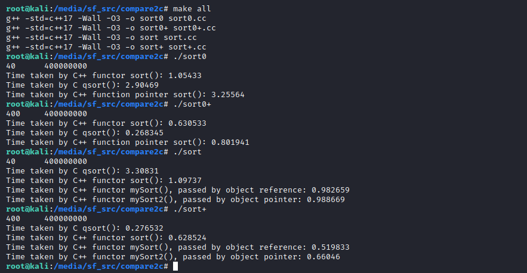

## C qsort() vs C++ sort()
Say let's try to sort 10M objects:
```c++
enum Gender : char  {M, W};

struct Employee {
	int id;
	Gender gender;
	char addr[10];
	double salary;
	double s;
	int t;	
};
	
const int N = (int) 1e7;
```
In `sort.cc`, the size of a single object is 40 bytes, so each array will require about 400 MiB of memory. In `sort+.cc`, we increase the `addr` size to 370, in turn, the size of each object will be 9 times larger (i.e. 400 bytes). Meanwhile we decrease the number of objects, otherwise it would be about 4GiB:scream:. `sort0.cc` and `sort0+.cc` ditto. 

Here are some results I've tested on my CentOS server and Kali virtual machine:      




See also some tests on line: [sort0](https://coliru.stacked-crooked.com/a/af0ba8941deb64f4),
 [sort0+](https://coliru.stacked-crooked.com/a/62800e4bbcbbbe8d).
