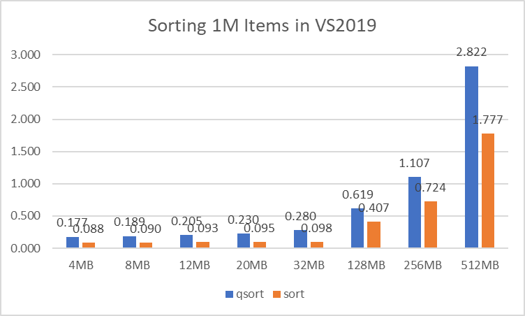
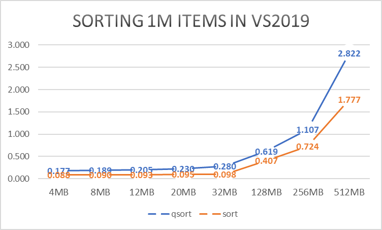
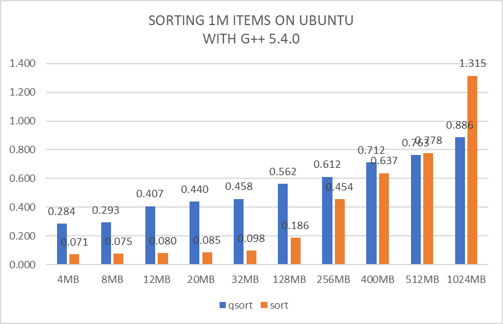
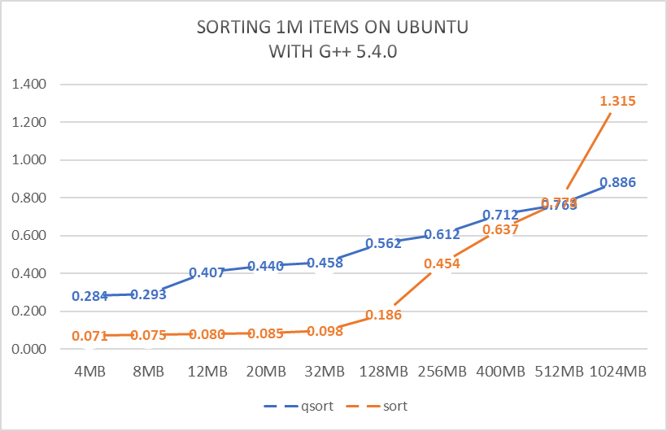
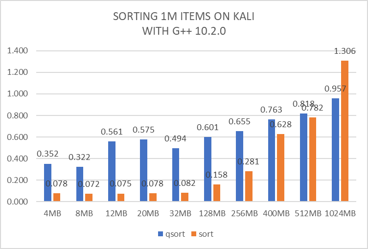
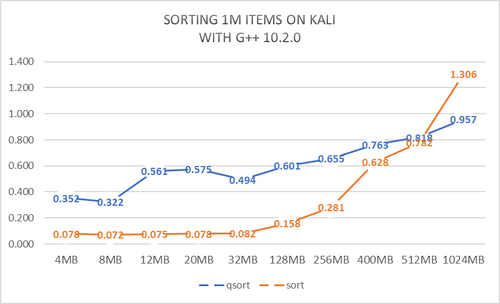
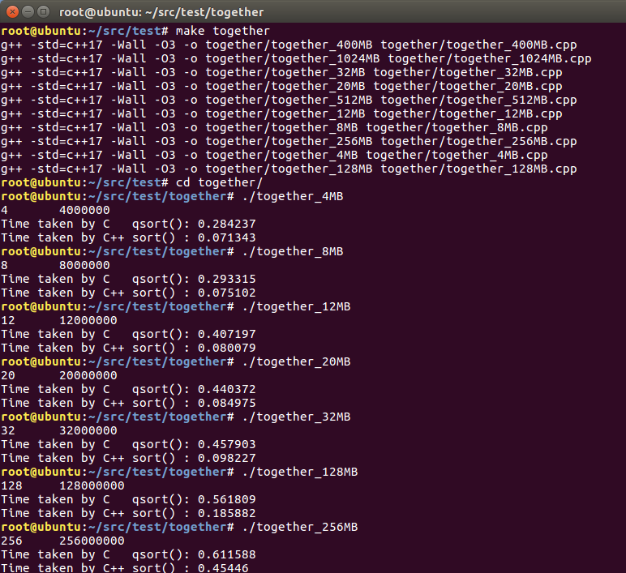
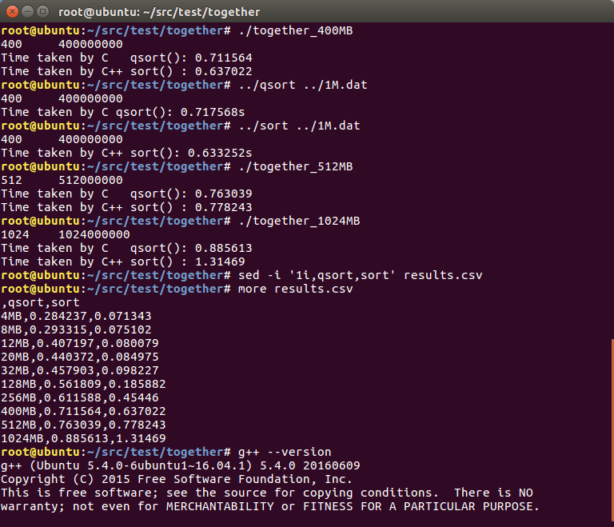
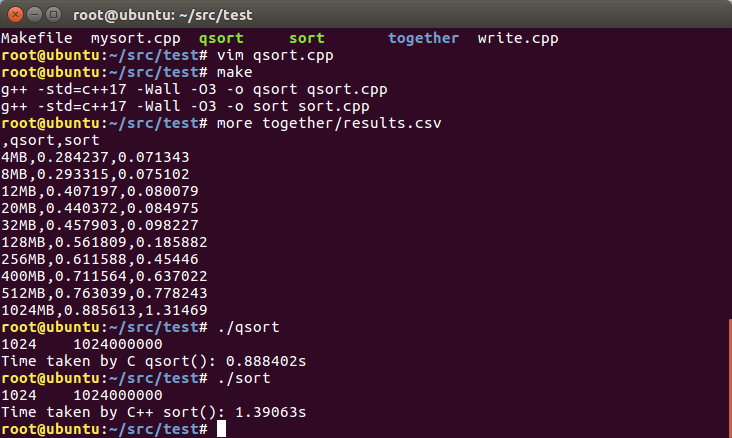

# C qsort vs C++ std::sort
Consider sorting 1 million objects:
```c++
struct Employee {
	int id;
	char others[28]; // try { 0, 4, 8, 16, 28, 124, 252, 396, 508, 1020 }
};
```
Of course, when the size of each object becomes large, say 1024 bytes, the structrue itself is poorly designed and makes little use of each cpu cache line (only 4 bytes of information are used while needing to cache the whole object). For test, we'll just try them out respectively, and see how the time varies as the object size grows.

Here are the results on VS2019 (x86), Ubuntu (g++ 5.4.0), Kali (g++ 10.2.0):
 | 
 | 
 | 

As we can see from above charts, Ubuntu and Kali have very similar results (they all Linux, and use g++), and object size 512 bytes seems to be a threshold, that is `std::sort` wins when <= 512B, `qsort` wins when > 512B.

Also very interesting to notice that on Kali line chart, when object size is 32 bytes, it is even faster than those of small sizes of 12 bytes and 20 bytes. A good explanation can be some sort of like this: a cache line typically is 64 bytes and every single cache line can exactly contain (cache) 2 objects, which are not the cases of 12 bytes and 20 bytes of object sizes. In those cases where cache line size is not an exact integer times of object sizes, an object may be spread on two cache lines and it can result in some overhead like data synchronization (I don't really know about this, but certainlly there will have some adverse effects, more or less). For 4 bytes and 8 bytes objects, they're small and perfect to fit into cache lines and thus have good performances.

# Execution




