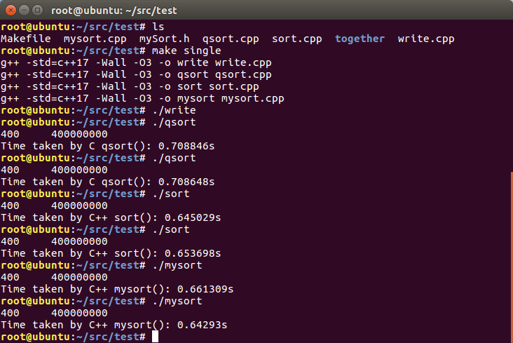

# C qsort vs C++ std::sort
Consider sorting 1 million objects:
```c++
struct Employee {
	int id;
	char others[28]; // try { 0, 4, 8, 16, 28, 124, 252, 396, 508, 1020 }
};
```

---

Of course, when the size of each object becomes large, say 1024 bytes, the structrue itself is poorly designed and 
makes little use of each cpu cache line (only 4 bytes of information are used while needing to cache the whole 
object). In fact, if we really want to sort an array of large objects (say 1KB), we can actually use a vector holding
an array of pointers (`vector<Employee*>`) to those objects, and then sort those pointers. That would be much faster
(after all we have cheapter swappings for pointer type):

 

From above screenshots we can see that sorting an array of pointers (`sort_pointers()`) to large objects of 1KB size
was almost as fast as `qsort` on 4 bytes `int` type objects. Besides, it's interesting to notice that `indirection_sort()`
which `sort pointers -> allocate memory & copy values -> copyback -> free memory`, i.e.
```c++
sort(&ve[0], &ve[0] + N, comp);
Employee* sorted_arr = (Employee*)malloc(sizeof(arr));
for (int i = 0; i < N; ++i) {
	sorted_arr[i] = *ve[i];
}
memcpy(arr, sorted_arr, sizeof(arr));
free(sorted_arr);
```
has similiar effects on both Kali and Ubuntu: First time executing it will have much longer time (about `2s`) than 
subsequent executions (about `0.75s`). One possible reason could be system warmups of `malloc` (1GB data) on heap. 
Once the system finish the warmup exercises (loading all essential components for dynamic memory allocation), 
subsequent calls to `malloc` could run more smoothly.

So we can actually be more faster than `qsort` via `indirection_sort` on large objects, but at the cost of
 doubling its memory usage ;)

---

For tests, however, we'll just try them out respectively, and see how the time varies as the object size grows.

Here are the results on VS2019 (x86), Ubuntu (g++ 5.4.0), Kali (g++ 10.2.0):

  

  

  

As we can see from above charts, Ubuntu and Kali have very similar results (they all Linux, and use g++), 
and object size 512 bytes seems to be a threshold, that is `std::sort` wins when <= 512B, `qsort` wins when > 512B.

Also very interesting to notice that on Kali line chart, when object size is 32 bytes, it is even faster
 than those of small sizes of 12 bytes and 20 bytes. A good explanation can be some sort of like this: 
 a cache line typically is 64 bytes and every single cache line can exactly contain (cache) 2 objects,
 which are not the cases of 12 bytes and 20 bytes of object sizes. In those cases where cache line size
 is not an exact integer times of object sizes, an object may be spread on two cache lines and it can
 result in some overhead like data synchronization (I don't really know about this, but certainlly 
 there will have some adverse effects, more or less). For 4 bytes and 8 bytes objects,
 they're small and perfect to fit into cache lines and thus have good performances.

# Execution



