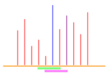

## Monotonic Queue

Let's implement the [rolling maximum](https://pandas.pydata.org/docs/reference/api/pandas.core.window.rolling.Rolling.max.html) algorithm in pandas. For simplicity, we'll use a simple integer array as our input and ignore null values that a robust library should handle gracefully.

The first version `rolling_max_naive()` performs a brute-force search for the maximum element in each window. But if we know the leaving element is not the maximum, we can just compare the new element with the last maximum. So, for the best-case scenario (data in ascending order), we only need to call `max_element()` every `w` elements, and the time complexity is thus `O(n-w) + n/w * O(w) = O(n)`. In the worst-case scenario, however, it becomes `O(n*w)` when the data is in descending order.

For small windows, the naive algorithm would probably suffice. But for a large window size, is there any data structure that supports efficient element deletion, insertion, and retrieval of the maximum element? Yup, that sounds like, ah, a balanced search tree! So, there it is, `rolling_max_large_window()` with `O(n*log(w))` time complexity.

```c++
std::vector<int> rolling_max_naive(const std::vector<int> &nums, int w) {
    // if (w > 64)
    //     return rolling_max_large_window(nums, w);
    std::vector<int> res;
    res.reserve(nums.size() - w + 1);
    res.push_back(*max_element(nums.begin(), nums.begin() + w));
    for (int i = w; i < nums.size(); i++) {
        // leaving element is greatest
        if (nums[i - w] == res[res.size() - 1]) {
            res.push_back(*max_element(nums.begin() + i - w + 1, nums.begin() + i + 1));
        } else if (nums[i] < res[res.size() - 1]) {
            res.push_back(res[res.size() - 1]);
        } else {
            res.push_back(nums[i]);
        }
    }
    return res;
}

std::vector<int> rolling_max_large_window(const std::vector<int> &nums, int w) {
    std::vector<int> res;
    res.reserve(nums.size() - w + 1);
    // Use greater so that the greatest element is at s.begin(). Otherwise, we need to
    // dereference rbegin(), i.e., *--s.end(), which requires an extra `_Rb_tree_decrement()`
    // call (which has a fast path for the header case though).
    std::multiset<int, std::greater<int>> s(nums.begin(), nums.begin() + w);
    res.push_back(*s.begin());
    for (int i = w; i < nums.size(); i++) {
        s.erase(s.find(nums[i - w]));
        s.insert(nums[i]);
        res.push_back(*s.begin());
    }
    return res;
}
```

Yeah, the performance improves significantly for large windows just as how math works. Then I tried pandas's `Rolling.max`, which's blazingly fast! So, I checked out the [Cython source code](https://github.com/pandas-dev/pandas/blob/v2.2.3/pandas/_libs/window/aggregations.pyx#L1070). It uses a monotonic queue which maintains a sequence in either monotonically increasing or decreasing order.

I could barely understand it at first. Then I found an amazing YouTube video on [monotonic stacks](https://www.youtube.com/watch?v=Dq_ObZwTY_Q). Things finally started to make sense! And the idea turns out to be darn simple yet incredibly powerful!!



Say, we have known the maximum element (the blue bar) in the current window (the green one). As the window slides to the right, the maximum element may or may not leave the window. If it does, it would be nice if we could know the next maximum with ease. Then why not just we maintain a **monotonically decreasing sequence**?

To maintain this monotonically decreasing sequence/queue, we need to
- Remove the maximum element from the front of the queue if it's no longer within the current window (`pop_front()`).
- Add the new element while maintaining the monotonicity. Initially, this looks quite like an insertion sort. We need to put the new element in the appropriate position. But do we really need to keep those elements that are less than or equal to the new element? No, just the rightmost/latest largest element. It's okay to leave some small values in between. The sequence of next maximums is all we need (see the blue and purple bars in the magenta window). So, the procedure becomes while the smallest element (`back()`) of the queue is no greater than the new element, pop it. Then add the new element.

Thus, we have the following intuitive C++ implementation:
```c++
std::vector<int> rolling_max(const std::vector<int> &nums, int w) {
    std::vector<int> res;
    res.reserve(nums.size() - w + 1);
    std::deque<int> dq;  // maintains a monotonically decreasing sequence

    for (int i = 0; i < nums.size(); i++) {
        // remove the maximum element if it's outside the current window
        if (!dq.empty() && dq.front() <= i - w)
            dq.pop_front();

        // add the current index to the deque while maintaining the monotonicity
        // e.g., add 2 into dq=[4, 2, 1]: pop 1, 2, push back the new 2
        while (!dq.empty() && nums[i] >= nums[dq.back()])
            dq.pop_back();
        dq.push_back(i);

        if (i >= w - 1)
            res.push_back(nums[dq.front()]);
    }
    return res;
}
```

How about the time complexity? Even though there's a while loop inside the outer for loop, the amortized time complexity is still `O(n)` because each element is pushed and popped at most once throughout the entire process. Beautiful!
